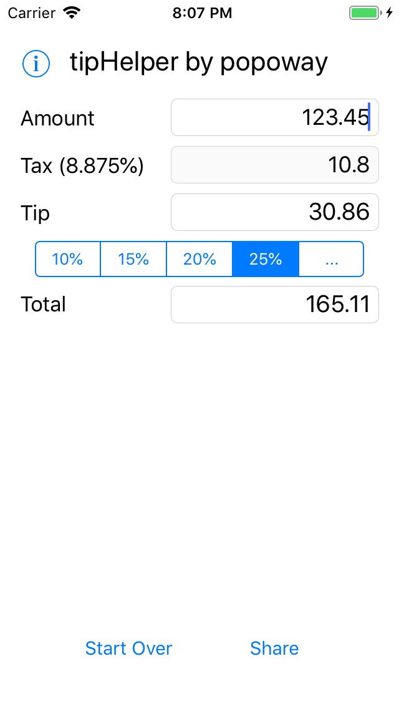

# tipHelper

simple iOS app for calculating tips

## Status

Basic calculation should work. However, there are many ux and logic optimizations required.  

- [x] basic calculation
- [x] responsive `tipSegmentedControl`
- [x] tap blank to close keyboard
- [x] share `total` result
- [x] basic logical error check
- [ ] check for extraneous dots
- [ ] adapt to new iPhones
- [ ] toggle tax / change tax rate
- [ ] bottom buttons attached to keyboard
- [ ] save settings: local storage

## Demo?

Currently unavailable due to budget issue.

## Contributing

[Fork](https://github.com/popoway/tipHelper/fork) this repository, and play with the codes!  

## License

[MIT](https://popoway.mit-license.org/)
